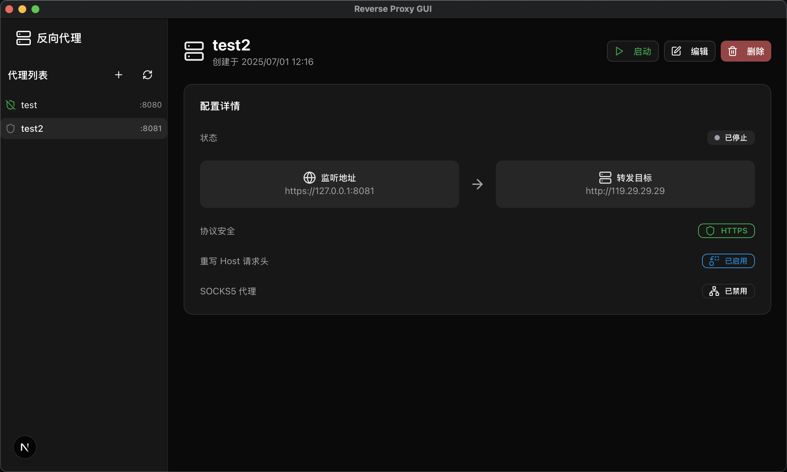

# ReverseProxyGUI


一个基于 **Tauri 2.0**, **Next.js 15** 和 **Axum** 构建的现代化、跨平台反向代理桌面应用。它提供了一个直观的图形用户界面，用于轻松创建、管理和监控反向代理配置。



## ✨ 功能特性

### 🎯 核心功能

- **现代化技术栈**: 使用 Next.js 15 (App Router) 和 React 19 构建，由 Tauri 2.0 驱动，后端采用高性能的 Rust 和 Axum 框架。
- **直观的用户界面**: 简洁、美观的 UI，使用 `shadcn/ui` 和 `Tailwind CSS` 构建，支持亮色和暗色主题。
- **跨平台支持**: 可在 Windows、macOS 和 Linux 上运行。

### 🔄 反向代理功能

- **HTTP/HTTPS 监听**: 支持为本地监听地址自动生成和管理自签名 SSL 证书。
- **灵活的路由**: 将本地端口的流量转发到任何远程服务器地址。
- **请求头重写**: 自动或手动重写 `Host`, `Referer`, `Origin` 等请求头，轻松解决跨域问题。
- **自定义请求头**: 为每个代理配置添加或修改自定义请求头。
- **SOCKS5 代理支持**: 为每个出站连接独立配置 SOCKS5 代理，增强网络灵活性和隐私性。
- **实时状态监控**: 在界面上实时查看每个代理的运行状态。
- **持久化配置**: 所有代理配置都保存在本地，应用重启后不会丢失。
- **动态端口检查**: 在创建或编辑配置时，自动检查监听端口是否被占用。

### 🚧 即将推出

- **🔌 协议扩展支持**: 
  - WebSocket (WSS) 支持  
  - gRPC 协议支持
- **🎯 响应拦截与修改**: 
  - 支持 URL 匹配正则表达式
  - 自定义响应包内容替换
  - 灵活的内容劫持配置
- **🌐 高级代理功能**:
  - 对外暴露 SOCKS5/HTTPS 代理端口
  - 智能域名匹配和路由
  - 支持二级代理链配置
  - 自动代理切换策略

## 🛠️ 技术栈

- **前端**:
  - [Next.js 15](https://nextjs.org/) (App Router & Turbopack)
  - [React 19](https://react.dev/)
  - [TypeScript](https://www.typescriptlang.org/)
  - [Tailwind CSS](https://tailwindcss.com/)
  - [shadcn/ui](https://ui.shadcn.com/)
  - [Lucide React](https://lucide.dev/) (图标)

- **后端 & 桌面**:
  - [Tauri 2.0](https://beta.tauri.app/)
  - [Rust](https://www.rust-lang.org/)
  - [Axum](https://github.com/tokio-rs/axum) (Web 框架)
  - [Tokio](https://tokio.rs/) (异步运行时)

- **包管理器**: [npm](https://www.npmjs.com/) (或 [Bun](https://bun.sh/))

## 🚀 快速开始

### 先决条件

在开始之前，请确保您已经安装了以下环境：

1.  **Rust**: [https://www.rust-lang.org/tools/install](https://www.rust-lang.org/tools/install)
2.  **Node.js**: [https://nodejs.org/](https://nodejs.org/) (建议使用 LTS 版本)
3.  **Tauri 2.0 依赖**: 请根据您的操作系统，按照 [Tauri 官方文档](https://tauri.app/start/prerequisites/) 完成环境配置。

### 安装与运行

1.  **克隆仓库**

    ```bash
    git clone https://github.com/your-username/ReverseProxyGUI.git
    cd ReverseProxyGUI
    ```

2.  **安装依赖**

    使用 `npm` 安装前端依赖：

    ```bash
    npm install
    ```

3.  **开发模式**

    在一个终端中启动 Next.js 前端开发服务器：

    ```bash
    npm run dev
    ```

    在另一个终端中，以开发模式启动 Tauri 应用。这将同时运行 Rust 后端和桌面窗口：

    ```bash
    npm run tauri dev
    ```

    应用窗口将会启动，并加载 Next.js 的内容。

### 构建应用

要为您的平台构建生产版本的应用，请运行：

```bash
npm run tauri build
```

构建完成后，安装包或可执行文件将位于 `src-tauri/target/release/bundle/` 目录下。

## 📂 项目结构

```
.
├── app/                # Next.js App Router 页面
├── components/         # React 组件
├── lib/                # 工具函数和 API 调用
├── public/             # 静态资源
├── src-tauri/          # Tauri Rust 后端代码
│   ├── src/
│   │   ├── lib.rs          # Rust 库入口，定义 Tauri 命令
│   │   ├── main.rs         # 主程序入口
│   │   └── proxy_manager.rs # 核心反向代理逻辑
│   └── tauri.conf.json # Tauri 应用配置
├── types/              # TypeScript 类型定义
├── LICENSE             # MIT 许可证
└── README.md           # 项目说明
```

## 🤝 贡献

欢迎各种形式的贡献！如果您有任何想法、建议或发现了 Bug，请随时创建 [Issue](https://github.com/your-username/ReverseProxyGUI/issues) 或提交 [Pull Request](https://github.com/your-username/ReverseProxyGUI/pulls)。

## 📄 许可证

该项目根据 [MIT 许可证](./LICENSE) 授权。

---

_由 ReverseProxyGUI 团队用心构建 ❤️_
